# ViCatcher:在大众视频平台上构建系统化知识学习体验

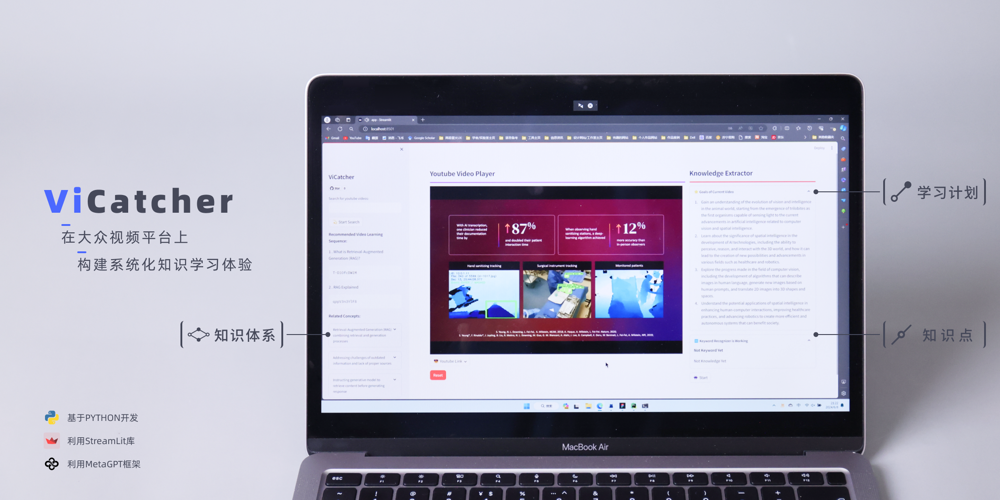

ViCatcher 是一个实时的视频辅助学习系统，支持学习者搜索大众视频平台的视频，为学习者整理多个视频中知识的关联，组织学习路径，并提供学习引导与支持。ViCatcher 提供了不同于MOOC等体系化视频知识平台的学习方式，有望支持个性化、灵活的视频知识学习。

## 安装
> 确保系统已安装 Python 3.9 或更高版本。可以使用以下命令来检查：`python --version`

```bash
pip install -r requirements.txt
python run.py
```
首先安装依赖项文件，之后运行`run.py`这一python文件，即可启动本系统。

## 详细介绍
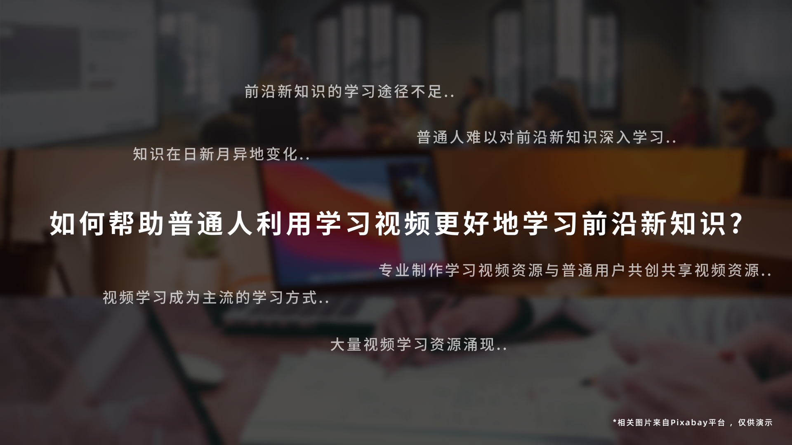
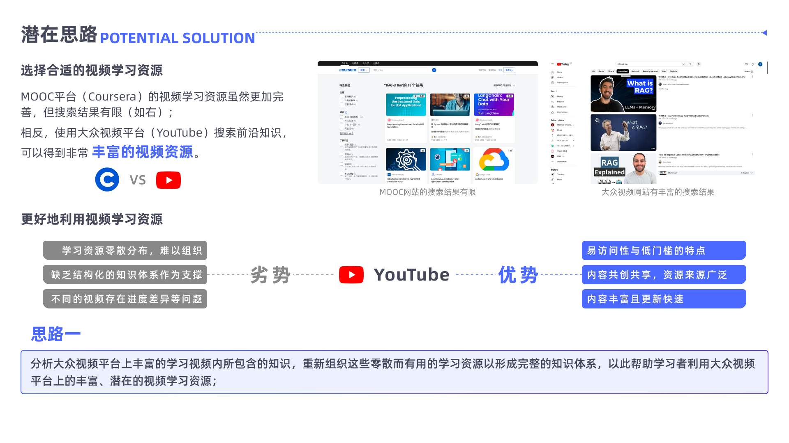
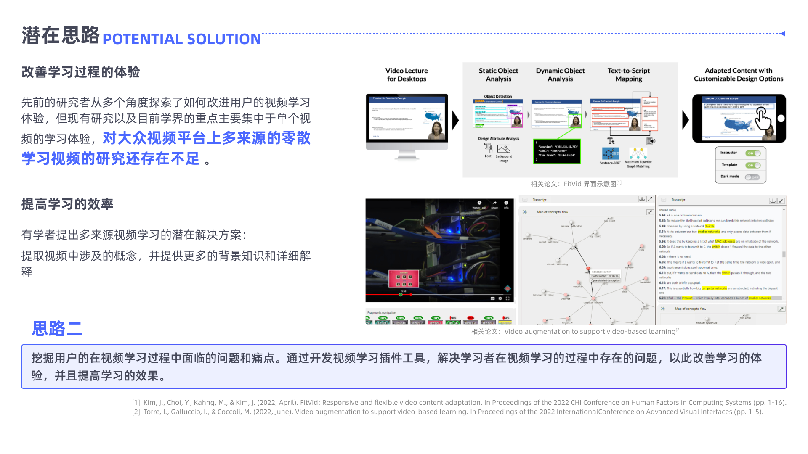
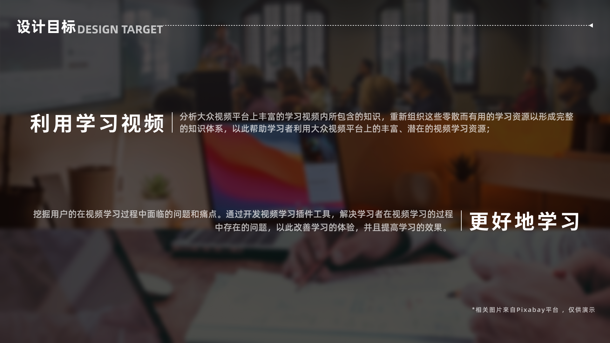
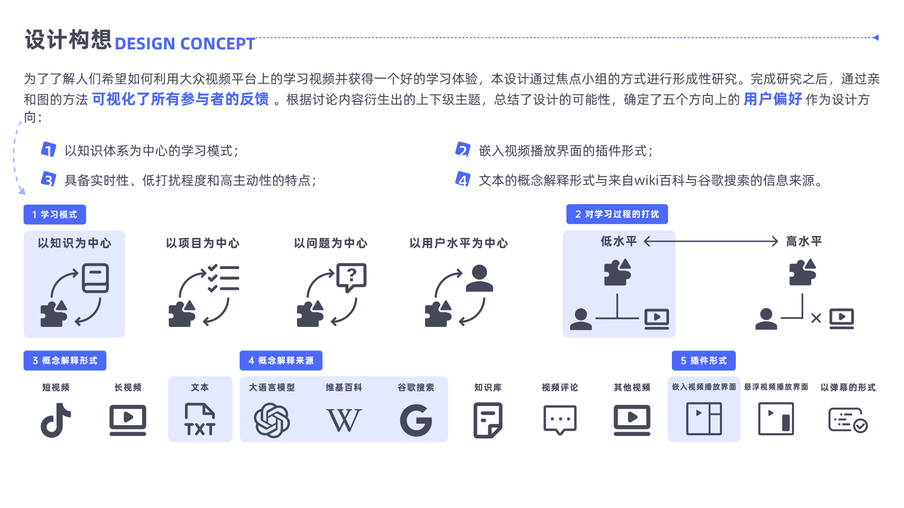
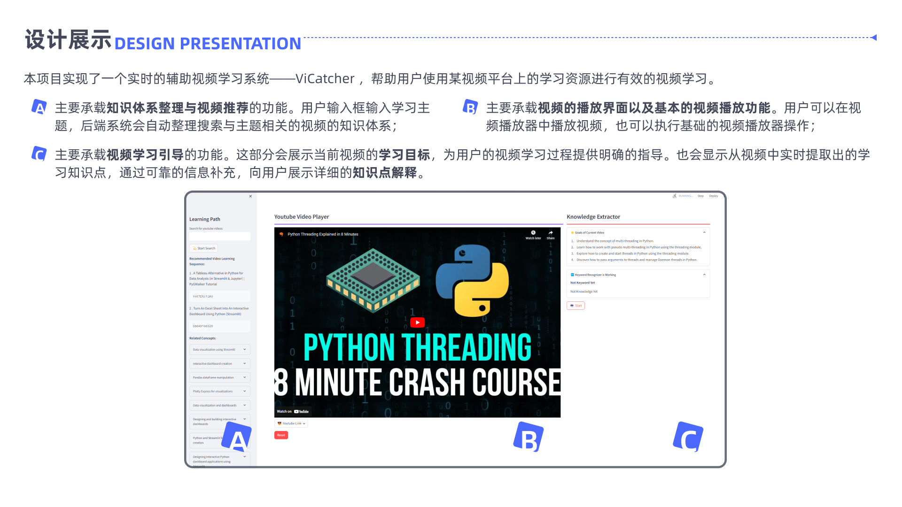
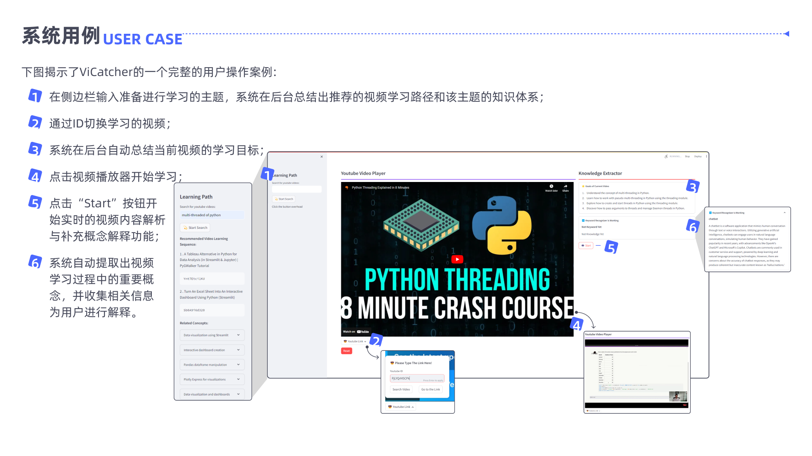
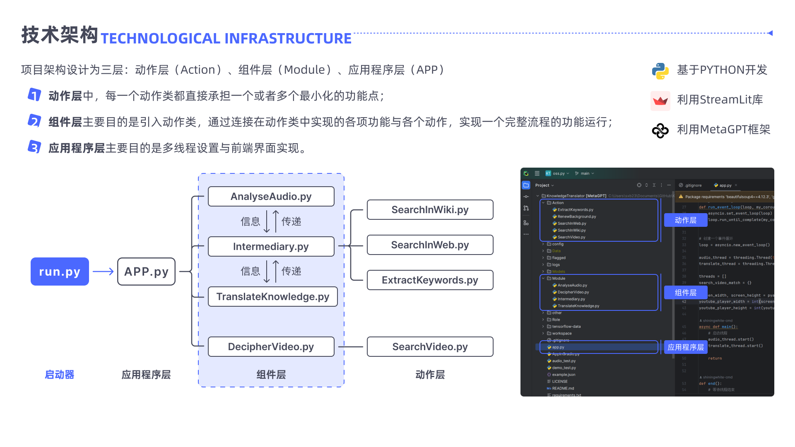
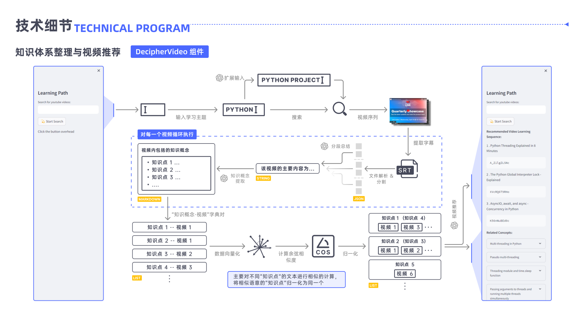
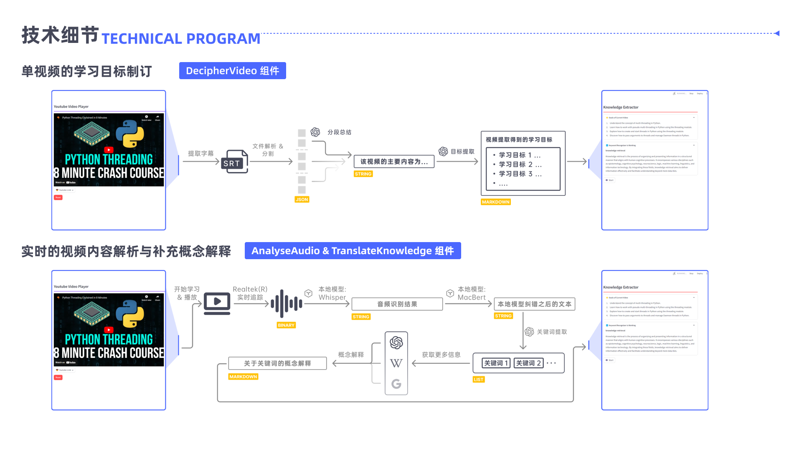

## 演示视频
<div style="padding:53.89% 0 0 0;position:relative;"><iframe src="https://player.vimeo.com/video/970307777?title=0&amp;byline=0&amp;portrait=0&amp;badge=0&amp;autopause=0&amp;player_id=0&amp;app_id=58479" frameborder="0" allow="autoplay; fullscreen; picture-in-picture; clipboard-write" style="position:absolute;top:0;left:0;width:100%;height:100%;" title="video"></iframe></div><script src="https://player.vimeo.com/api/player.js"></script>

## 联系方式
这个项目目前还有数个工程上的问题亟需解决。如果你对这个项目感兴趣，或者有任何的建议，欢迎通过邮箱：3200102512@zju.edu.cn 联系我。